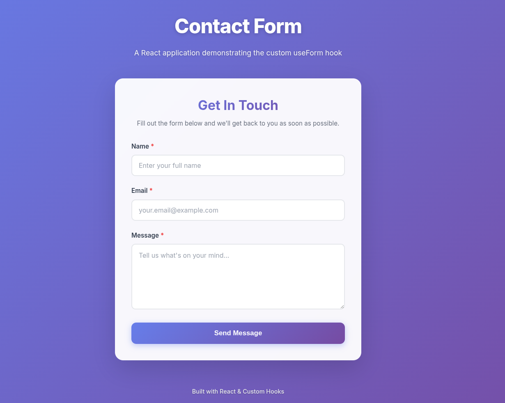
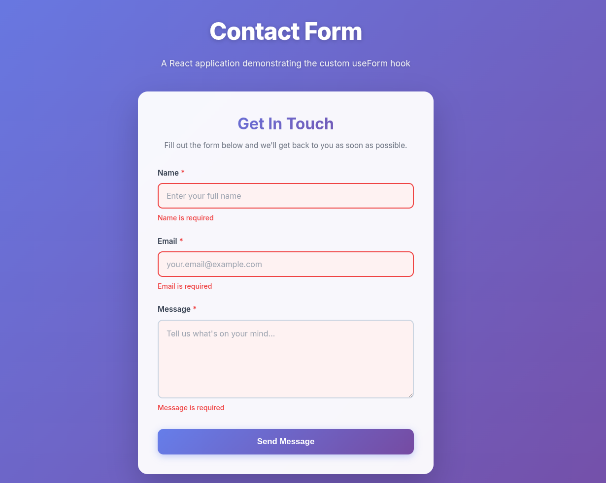
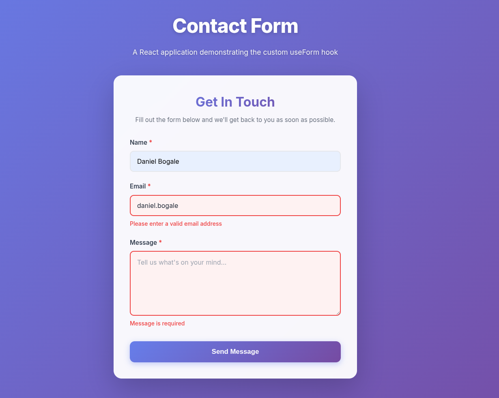
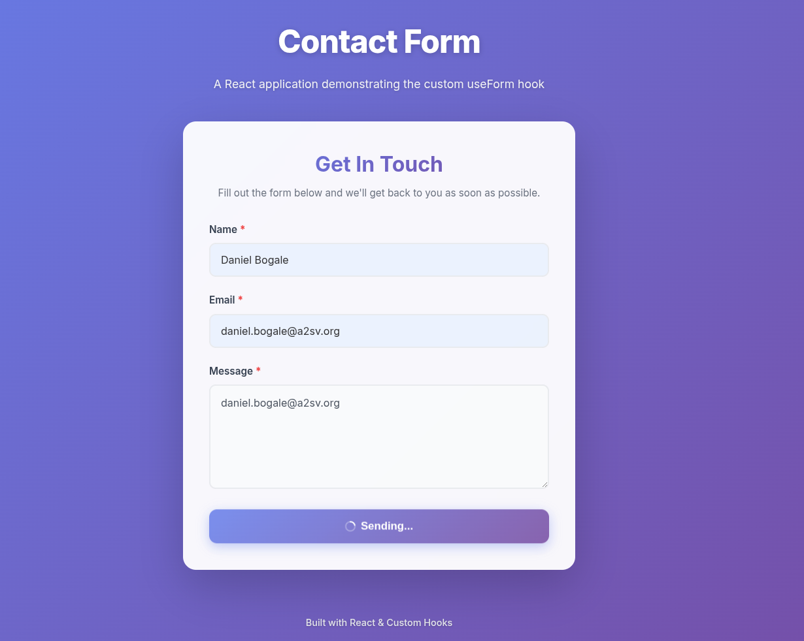
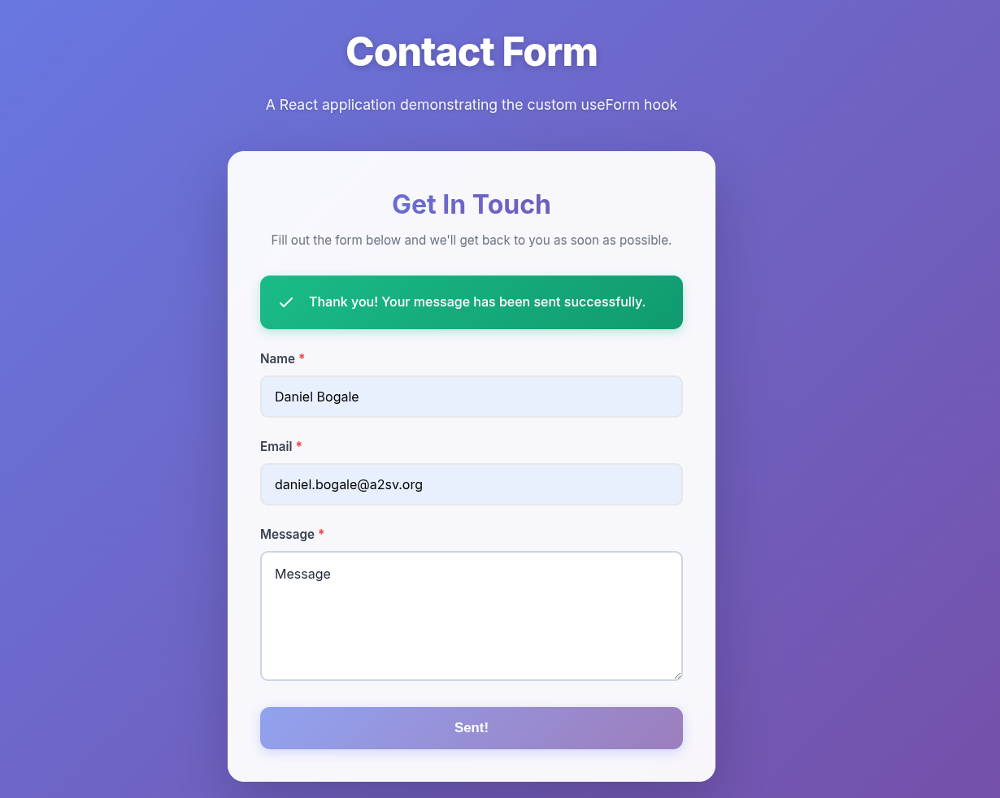

# Contact Form Application with useForm Hook

A modern, responsive contact form built with React that demonstrates the implementation and usage of a custom `useForm` hook for form state management and validation.

## 📋 Project Description

This project is a React-based contact form application that showcases the power of custom React hooks. The application features a clean, intuitive interface with robust form validation, real-time error feedback, and a smooth user experience. It demonstrates best practices in React development, including custom hook creation, component composition, and modern CSS styling.

## ✨ Features

- **Custom `useForm` Hook**: A reusable hook that manages form state, validation, and submission
- **Form Validation**: 
  - Required field validation for all inputs
  - Email format validation using regex patterns
  - Real-time error feedback as users interact with the form
- **Responsive Design**: Mobile-first approach that works seamlessly across all device sizes
- **Modern UI/UX**:
  - Glassmorphism effects and gradient backgrounds
  - Smooth animations and transitions
  - Interactive hover and focus states
  - Success message with auto-reset functionality
- **Accessibility**: Proper labels, ARIA attributes, and keyboard navigation support
- **Clean Code**: Well-commented, organized, and following React best practices

## 🚀 Installation and Setup

### Prerequisites

- Node.js (version 14 or higher)
- npm or yarn package manager

### Installation Steps

1. **Navigate to the project directory**:
   ```bash
   cd contact-form-react
   ```

2. **Install dependencies**:
   ```bash
   npm install
   ```

3. **Start the development server**:
   ```bash
   npm run dev
   ```

4. **Open your browser** and navigate to the URL shown in the terminal (typically `http://localhost:5173`)

## 📁 Project Structure

```
contact-form-react/
├── src/
│   ├── hooks/
│   │   └── useForm.js          # Custom form hook with validation logic
│   ├── components/
│   │   ├── ContactForm.jsx     # Main contact form component
│   │   └── ContactForm.css     # Component-specific styles
│   ├── App.jsx                 # Root application component
│   ├── App.css                 # Application-level styles
│   ├── index.css               # Global styles and CSS variables
│   └── main.jsx                # Application entry point
├── public/                     # Static assets
├── index.html                  # HTML template
├── package.json                # Project dependencies and scripts
├── vite.config.js              # Vite configuration
└── README.md                   # Project documentation
```

## 🛠️ Technologies Used

- **React 18**: Modern React with functional components and hooks
- **Vite**: Next-generation frontend tooling for fast development
- **CSS3**: Modern CSS with custom properties, flexbox, and animations
- **JavaScript ES6+**: Modern JavaScript features and syntax

## 📝 Form Validation Rules

### Name Field
- **Type**: Text input
- **Required**: Yes
- **Validation**: Must not be empty or contain only whitespace

### Email Field
- **Type**: Email input
- **Required**: Yes
- **Validation**: 
  - Must not be empty
  - Must match valid email format (e.g., user@example.com)
  - Uses regex pattern: `/^[^\s@]+@[^\s@]+\.[^\s@]+$/`

### Message Field
- **Type**: Textarea
- **Required**: Yes
- **Validation**: Must not be empty or contain only whitespace

## 🎯 How the useForm Hook Works

The custom `useForm` hook manages all aspects of form handling:

1. **State Management**:
   - `values`: Stores current form field values
   - `errors`: Tracks validation errors for each field
   - `isSubmitting`: Indicates if form is being submitted
   - `isSubmitted`: Indicates successful submission

2. **Validation**:
   - Real-time validation on field change
   - Comprehensive validation on form submission
   - Clear error messages for better UX

3. **Event Handlers**:
   - `handleChange`: Updates field values and clears errors
   - `handleSubmit`: Validates and processes form submission
   - `resetForm`: Resets form to initial state

## 🎨 Design Features

- **Color Scheme**: Purple gradient theme with modern aesthetics
- **Typography**: Inter font family for clean, professional look
- **Animations**: 
  - Fade-in effects on page load
  - Slide-down animation for success messages
  - Shake animation for error messages
  - Smooth transitions on all interactive elements
- **Responsive Breakpoints**:
  - Desktop: Full-width with optimal spacing
  - Tablet: Adjusted padding and font sizes
  - Mobile: Compact layout optimized for small screens

## 🧪 Testing the Application

### Manual Testing Checklist

1. **Required Field Validation**:
   - Try submitting the form with empty fields
   - Verify error messages appear for all required fields

2. **Email Format Validation**:
   - Enter invalid email formats (e.g., "test", "test@", "test@domain")
   - Verify appropriate error message appears
   - Enter valid email and verify error clears

3. **Form Submission**:
   - Fill all fields with valid data
   - Submit the form
   - Verify success message appears
   - Check browser console for submitted data

4. **Form Reset**:
   - After successful submission, wait 3 seconds
   - Verify form resets to initial state

5. **Responsive Design**:
   - Test on different screen sizes
   - Verify layout adapts appropriately

## 📸 Screenshots








## 🎓 Learning Objectives Achieved

✅ Understanding and implementation of custom React hooks  
✅ Form state management using hooks  
✅ Form validation with real-time feedback  
✅ Component composition and reusability  
✅ Modern CSS styling with animations  
✅ Responsive web design principles  
✅ Clean code practices and documentation  

## 🚀 Future Enhancements

- Integration with backend API for actual form submission
- Additional form fields (phone number, subject, etc.)
- File upload functionality
- Form data persistence using localStorage
- Unit tests using React Testing Library
- Integration with email services (SendGrid, Mailgun, etc.)

## 📄 License

This project is created for educational purposes as part of the A2SV project phase submissions.

## 👨‍💻 Author

Built with ❤️ using React and Custom Hooks

---

**Note**: This is a demonstration project showcasing the use of custom React hooks for form management. In a production environment, you would integrate this with a backend API to handle actual form submissions.
