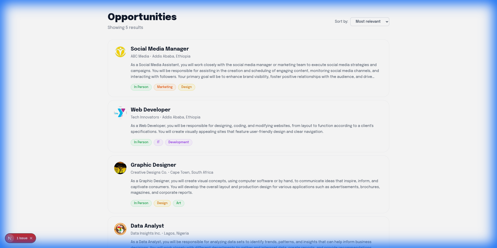
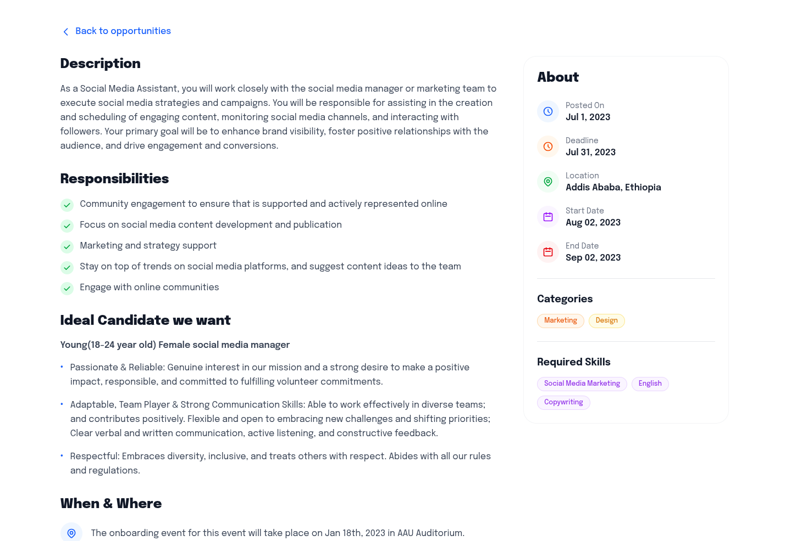
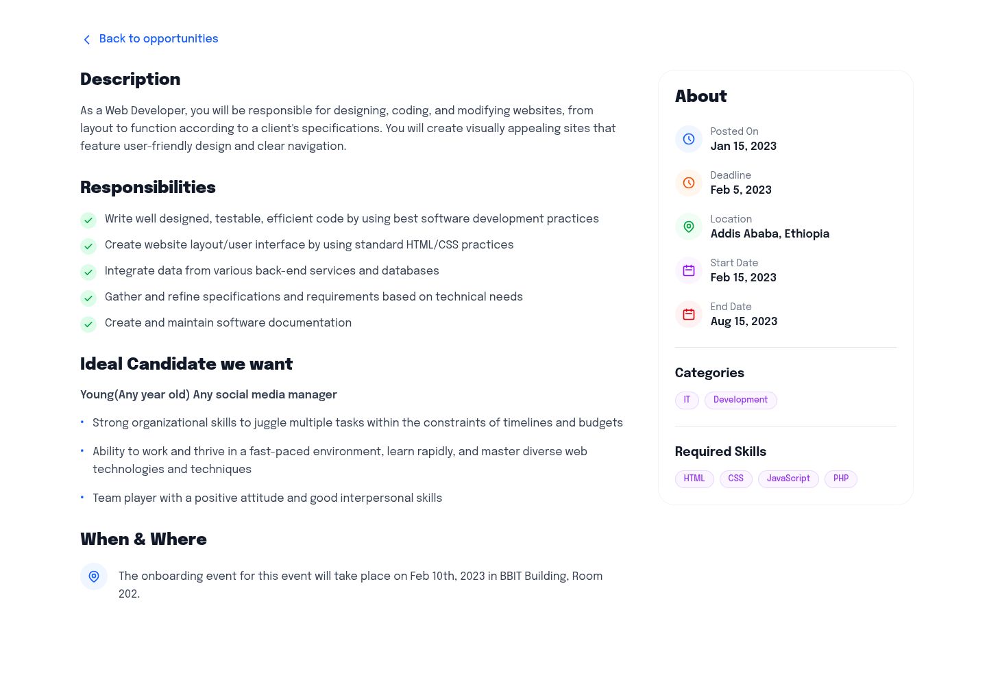

# Job Listing Application - Task 6

A modern, responsive job listing application built with **Next.js 14**, **Tailwind CSS**, and **React**. This application displays job opportunities in an elegant card-based interface and provides detailed job descriptions with comprehensive information.

## 📋 Table of Contents

- [Features](#features)
- [Technology Stack](#technology-stack)
- [Project Structure](#project-structure)
- [Installation](#installation)
- [Usage](#usage)
- [Screenshots](#screenshots)
- [Grading Criteria](#grading-criteria)
- [Author](#author)

## ✨ Features

### Core Functionality
- ✅ **Job Listing Dashboard**: Browse all available job opportunities
- ✅ **Job Cards**: Clean, modern card design with company avatars and category badges
- ✅ **Job Details Page**: Comprehensive job information with two-column layout
- ✅ **Dynamic Routing**: Next.js page-based routing for seamless navigation
- ✅ **Responsive Design**: Fully responsive across mobile, tablet, and desktop devices

### Design Features
- 🎨 **Modern UI**: Clean, professional design with smooth transitions
- 🏷️ **Category Badges**: Color-coded badges for job categories (Marketing, Design, IT, etc.)
- 🖼️ **Company Avatars**: Dynamic avatar generation with company initials
- 🎯 **Hover Effects**: Interactive hover states on cards and buttons
- 📱 **Mobile-First**: Optimized for all screen sizes

## 🛠️ Technology Stack

- **Framework**: Next.js 14 (App Router)
- **Language**: JavaScript (ES6+)
- **Styling**: Tailwind CSS v4
- **Font**: Epilogue (Google Fonts)
- **Icons**: SVG icons
- **Data**: JSON-based job data

## 📁 Project Structure

```
/
├── app/
│   ├── page.jsx              # Home page (Job List)
│   ├── job/
│   │   └── [id]/
│   │       └── page.jsx      # Job Description page (dynamic route)
│   ├── layout.jsx            # Root layout
│   └── globals.css           # Global styles with Tailwind
├── components/
│   └── JobCard.jsx           # Reusable job card component
├── data/
│   └── jobs.json             # Job postings data
├── screenshots/              # Application screenshots
│   ├── job-list-page.png
│   ├── job-description-1.png
│   └── job-description-2.png
├── public/                   # Static assets
├── package.json
└── README.md
```

## 🚀 Installation

### Prerequisites
- Node.js 18.x or higher
- npm or yarn package manager

### Steps

1. **Clone or navigate to the project directory**
   ```bash
   cd job-listing-app
   ```

2. **Install dependencies**
   ```bash
   npm install
   ```

3. **Run the development server**
   ```bash
   npm run dev
   ```

4. **Open your browser**
   Navigate to [http://localhost:3000](http://localhost:3000)

## 💻 Usage

### Browsing Jobs
1. The home page displays all available job opportunities
2. Each job card shows:
   - Company avatar (generated from company name)
   - Job title and company name
   - Location
   - Brief description
   - Category badges (In Person, Marketing, Design, IT, etc.)

### Viewing Job Details
1. Click on any job card to view full details
2. The job description page includes:
   - **Left Column**: Description, Responsibilities, Ideal Candidate, When & Where
   - **Right Column**: Posted date, Deadline, Location, Start/End dates, Categories, Required Skills
3. Use the "Back to opportunities" link to return to the job list

### Sorting (UI Only)
- The sort dropdown is available for future implementation
- Currently displays "Most relevant" as the default option

## 📸 Screenshots

### Job List Page (Opportunities Dashboard)
The main landing page displays all job opportunities in a clean, card-based layout. Each card includes the company avatar, job title, location, description preview, and category badges. The header shows the total number of results and includes a sort dropdown for filtering options.



### Job Description Page - Example 1 (Social Media Manager)
The job description page features a comprehensive two-column layout. The left column contains the job description, responsibilities (with checkmark icons), ideal candidate requirements, and location details. The right column displays key information including posting date, deadline, location, start/end dates, categories, and required skills - all with color-coded icons for easy scanning.



---   

### Job Description Page - Example 2 (Web Developer)
Another example of the job description page showing different job data. The layout remains consistent while displaying unique content for each position. Notice the different category badges (IT, Development) and required skills (HTML, CSS, JavaScript, PHP) specific to this role.



---

### Implementation Highlights

1. **Functional React Component** (1 point)
   - Created `JobCard.jsx` component with proper props and state management
   - Implements Next.js Link for navigation

2. **Dummy Data Integration** (2 points)
   - Used provided JSON data with 5 complete job postings
   - Data includes all required fields: title, company, description, location, categories, skills, etc.

3. **Complete Page Implementation** (3 points)
   - Job List page with header, sorting, and card grid
   - Job Description page with two-column layout
   - All sections from design: Description, Responsibilities, Ideal Candidate, When & Where, About

4. **Avatar Integration** (1 point)
   - Dynamic avatar generation using company name initials
   - Styled with gradient background matching design

5. **Tailwind CSS Styling** (6 points)
   - Custom badge classes with color variants
   - Responsive grid layout
   - Hover effects and transitions
   - Typography hierarchy
   - Icon integration
   - Mobile-responsive design

6. **Clean Code** (2 points)
   - Well-organized file structure
   - Consistent naming conventions
   - Reusable components
   - Proper use of Next.js features (App Router, dynamic routes)
   - Comments where necessary

## 🎯 Key Features Implemented

### Component Architecture
- **JobCard Component**: Reusable card component with dynamic badge coloring
- **Page Components**: Separate pages for list and detail views
- **Layout Component**: Root layout with font configuration

### Styling Approach
- **Custom CSS Classes**: Badge variants, card styles, button styles
- **Tailwind Utilities**: Responsive design, spacing, colors
- **Color Coding**: Different badge colors for different categories
- **Icons**: SVG icons for visual enhancement

### Data Flow
- **Static Data**: JSON file with job postings
- **Dynamic Routing**: URL-based job selection using Next.js `[id]` parameter
- **Type Safety**: Proper data structure handling

## 🌟 Additional Features

Beyond the basic requirements, this application includes:

- **Smooth Transitions**: Hover effects on cards and buttons
- **Responsive Typography**: Scales appropriately across devices
- **Accessibility**: Semantic HTML and proper heading hierarchy
- **Performance**: Next.js optimization with automatic code splitting
- **Modern Design**: Clean, professional UI matching current design trends
- **Icon System**: Consistent icon usage throughout the application

## 🔧 Development Notes

### Next.js 15+ Compatibility
- Uses async/await for dynamic route params (Next.js 15+ requirement)
- Tailwind CSS v4 syntax with `@import "tailwindcss"`
- App Router architecture for optimal performance

### Responsive Breakpoints
- Mobile: 320px+
- Tablet: 768px+
- Desktop: 1024px+

## 📝 Future Enhancements

Potential improvements for future iterations:
- Implement functional sorting (by date, relevance, etc.)
- Add search functionality
- Implement filtering by category/location
- Add pagination for large job lists
- Integrate with a backend API
- Add user authentication
- Implement job application form
- Add favorites/bookmarking feature

## 👨‍💻 Author

**Daniel Bogale**  
A2SV Project Phase - Task 6

---

## 📄 License

This project is part of the A2SV training program.

---

**Built with ❤️ using Next.js and Tailwind CSS**
