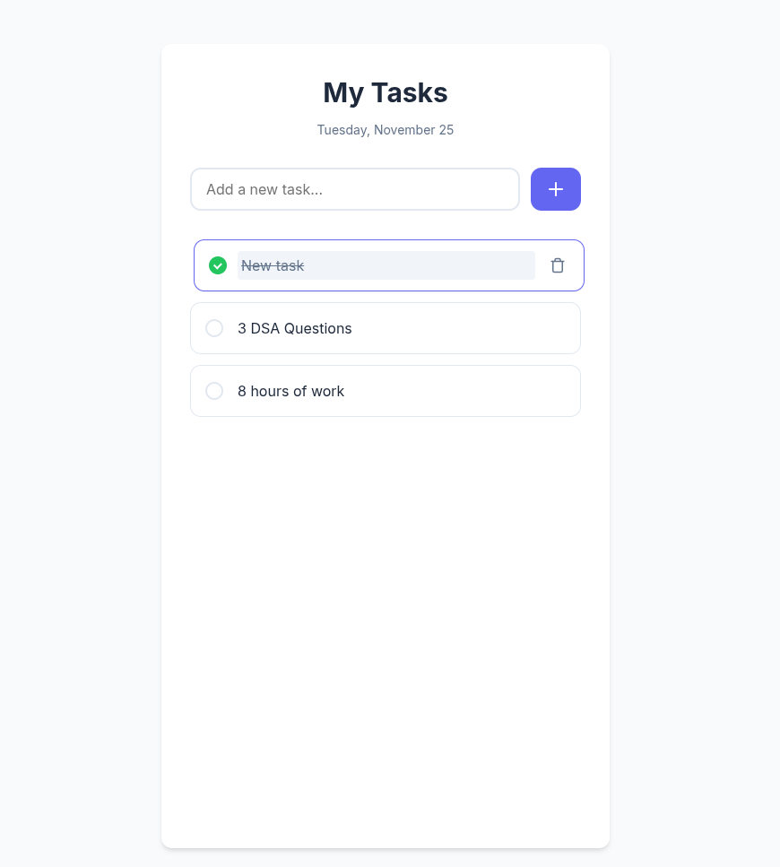

# Todo List Application

A clean, modern, and responsive Todo List application built with vanilla HTML, CSS, and JavaScript. This project allows users to manage their daily tasks with ease, featuring data persistence and a smooth user interface.

## Features

-   **Add Tasks**: Quickly add new tasks to your list.
-   **Edit Tasks**: Click on any task text to edit it inline.
-   **Delete Tasks**: Remove tasks you no longer need.
-   **Mark as Complete**: Toggle tasks as completed with a custom checkbox.
-   **Local Storage**: Your tasks are saved automatically and persist even after refreshing the page.
-   **Responsive Design**: Works perfectly on desktop and mobile devices.
-   **Animations**: Smooth transitions for adding, deleting, and hovering over tasks.

## Folder Structure

```
todo-list-app/
│
├── index.html      # Main HTML structure
├── style.css       # CSS styles and animations
├── script.js       # JavaScript logic
└── README.md       # Project documentation
```

## How to Run

1.  Clone or download this repository.
2.  Navigate to the `todo-list-app` folder.
3.  Open `index.html` in any modern web browser (Chrome, Firefox, Safari, Edge).
4.  Start managing your tasks!

## Screenshots



## Instructions

1.  **Adding a Task**: Type your task in the input field and press "Enter" or click the "+" button.
2.  **Editing**: Click directly on the text of any task to edit it. Press "Enter" or click away to save.
3.  **Completing**: Click the checkbox circle to mark a task as done.
4.  **Deleting**: Hover over a task and click the trash icon to remove it.
