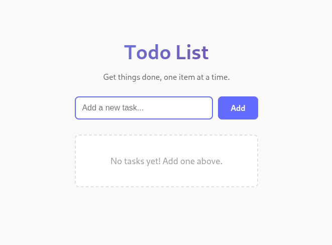
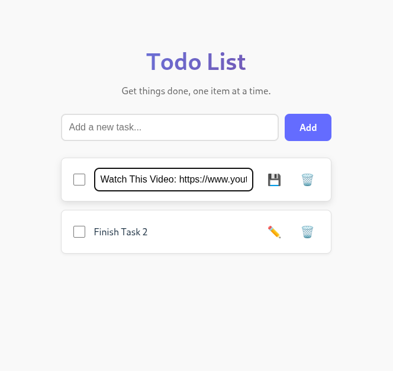

# Todo List Application

A modern, fully functional Todo List application built with **React** and **TypeScript**. This app allows users to add, edit, delete, and view tasks with a clean and responsive UI.

## Features

- ✅ **Add tasks**: Create new todo items
- ✏️ **Edit tasks**: Modify existing tasks inline
- 🗑️ **Delete tasks**: Remove completed or unwanted tasks
- ✔️ **Toggle completion**: Mark tasks as complete/incomplete
- 💾 **Local storage**: Tasks persist across browser sessions
- 📱 **Responsive design**: Works seamlessly on desktop and mobile devices

## Tech Stack

- **React** - UI library
- **TypeScript** - Type-safe JavaScript
- **Vite** - Fast build tool and dev server
- **CSS3** - Modern styling with animations

## Installation and Setup

### Prerequisites

- Node.js (v14 or higher)
- npm or yarn

### Steps to Run

1. **Clone or download the project**

2. **Navigate to the project directory**
   ```bash
   cd todo-list-react
   ```

3. **Install dependencies**
   ```bash
   npm install
   ```

4. **Start the development server**
   ```bash
   npm run dev
   ```

5. **Open your browser**
   - The app will be running at `http://localhost:5173`

## Build for Production

To create a production build:

```bash
npm run build
```

The optimized files will be in the `dist/` folder.

## Project Structure

```
/todo-list-react
  ├── src/
  │     ├── components/
  │     │       ├── TodoItem.tsx      # Individual todo item component
  │     │       └── TodoList.tsx      # List of todos component
  │     ├── App.tsx                   # Main application component
  │     ├── App.css                   # Application styles
  │     ├── index.tsx                 # Entry point
  │     ├── index.css                 # Global styles
  │     └── types.ts                  # TypeScript type definitions
  ├── public/
  ├── package.json
  ├── tsconfig.json
  ├── vite.config.ts
  └── README.md
```

## Usage

1. **Add a task**: Type in the input field and click "Add" or press Enter
2. **Complete a task**: Click the checkbox or the task text
3. **Edit a task**: Click the edit (✏️) button, modify the text, and click save (💾)
4. **Delete a task**: Click the delete (🗑️) button

## Screenshots



---

**Developed with ❤️ using React and TypeScript**
