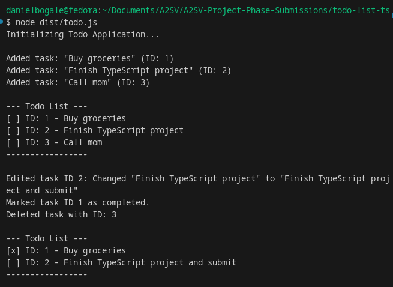

# TypeScript Todo List Application

A simple, strongly-typed Todo List application built with TypeScript. This project demonstrates basic CRUD operations (Create, Read, Update, Delete) using TypeScript interfaces and functions.

## 📂 Folder Structure

```
/todo-list-ts
  ├── src/
  │     └── todo.ts        # TypeScript source code
  ├── dist/
  │     └── todo.js        # Compiled JavaScript code
  ├── tsconfig.json        # TypeScript configuration
  ├── package.json         # Project dependencies
  └── README.md            # Project documentation
```

## 🚀 How to Setup and Compile

1.  **Install Dependencies**
    Ensure you have Node.js installed. Then, install the dependencies (TypeScript):
    ```bash
    npm install
    ```

2.  **Compile TypeScript to JavaScript**
    Run the TypeScript compiler to generate the JavaScript file in the `dist` folder:
    ```bash
    npx tsc
    ```
    Or if you have TypeScript installed globally:
    ```bash
    tsc
    ```

## 🏃 How to Run

After compiling, you can run the generated JavaScript file using Node.js:

```bash
node dist/todo.js
```

## 📸 Screenshots



## 💡 Example Usage

The application is designed to run in the console. When you run `node dist/todo.js`, it will execute a demonstration of the features:

1.  **Add Tasks**: Adds "Buy groceries", "Finish TypeScript project", etc.
2.  **List Tasks**: Displays all current tasks with their ID and completion status.
3.  **Edit Task**: Updates the title of a specific task.
4.  **Complete Task**: Marks a task as completed.
5.  **Delete Task**: Removes a task from the list.

**Code Snippet Example:**

```typescript
// Adding a task
addTodo("Learn TypeScript");

// Listing tasks
listTodos();

// Editing a task
editTodo(1, "Learn TypeScript Basics");

// Deleting a task
deleteTodo(1);
```
